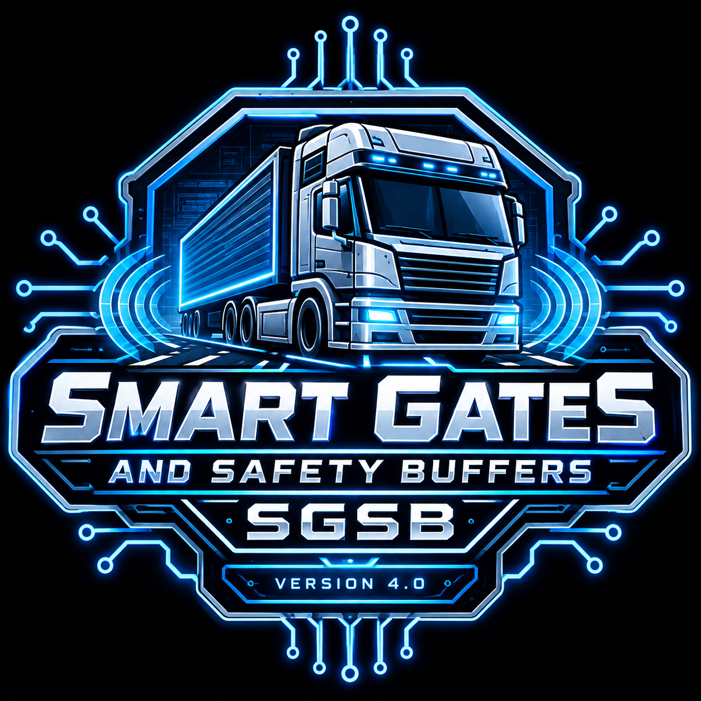

Smart Gates & Safety Buffers (SGSB) — v4.0.1-8826(Midnight Train)
	"The House That Code Built"

A Note from the Developer
  
This project is dedicated to the glory of God. Every mile driven and every line of code written is an expression of gratitude for the journey. May this mod bring a little more order, peace, and grace to the virtual highways we all travel. This is our first mod ever, so please extend us some grace!

Full Release Log
https://github.com/insanity35/Smart-Gates-Tolls-and-Safety-Buffers

**NOTICE NEEDS TO BE ABOVE SOUNDFIXES!!! Also , lot of gates are hardcoded in the map editor at distances I cannot control that!**

The Problem: "Gate Lag"
After years of long-haul trucking in American Truck Simulator, we know that immersion is everything. Nothing kills the flow of a delivery faster than "gate lag"—that frustrating moment when you are at the yard threshold, waiting for a barrier to crawl open while your multi-ton rig is already stalled out.

The Solution: Smart Gates & Safety Buffers
SGSB is the definitive logic overhaul for gate operations. We have stripped away the inconsistent, immersion-breaking triggers of the base game and replaced them with a standardized, high-performance logic set. 
Whether you are hauling heavy cargo into a Phoenix warehouse or navigating a tight depot in the Midwest, your gates will now respond with the reliable precision a professional driver expects. Built by a driver, for drivers.
  	
	Official Release Information
    Current Version: v4.0.1-8826(Midnight Train)(Stable)
    Official Launch Date (v1.0): Tuesday, July 14, 2026
    ATS Compatibility: v1.60.* branch (Until SCS breaks the core gate code)
    Development Environment: Ubuntu 26.04 LTS via Linux
    Architecture: Pure definition-only (.sii) layout

Complete Mod Genesis & Release History

The Early Development Phase

    June 2026 [Alpha Phase: Extraction & Mapping]: Natively developed on Ubuntu 26.04. Utilized the sk-zk Extractor tool to dissect def.scs and base.scs. Performed a deep-dive code analysis to map game logic specifically within animated_gate blocks and identify critical trigger/reset dependencies.

    July 10–11, 2026 [Beta Testing: Stress Testing the Framework]: Field-tested across high-density industrial hubs in Phoenix and Stockton. Confirmed 100% Convoy-ready multiplayer compatibility with zero "mod-mismatch" errors.

    July 11–14, 2026 [Release Candidate 1.0: Real-World Discoveries]: Implemented a standardized 47m trigger distance for all industrial yard gates to ensure full clearance for double and triple trailer combinations. Discovered during a vacation road trip that the engine handles rest distances automatically now; native reset code remains commented out until v1.7.

    July 14, 2026 [Version 1.0.0: Public Launch]: Initial public release. Successfully moved gate trigger zones significantly further away from the physical frames.

Version History & Changelog Evolution

	v4.0.1-8826(Hotfix)
	added animated_gate.dlc_or.sii to unit hookup and pulled metal_01 & metal_rev_01. Thanks FunGaming44 for the catch!

v4.0-8726(Midnight Train)
    Comprehensive Regional Audit: Completed a full asset scan and integration across all official ATS map expansions and major regional packages.
    Granular Behavioral Tuning: Transitioned from uniform triggers to precise, environment-specific distance profiles (high-speed e-tolls, strict cash lanes, and realistic security checkpoints).
Regional Map Expansions & Asset Additions
    Montana Expansion: Added the Miles City Gate, Great Falls Airport Gate, Sidney Memorial Gate, and Gateway Canyon Gas.
    Wyoming Expansion: Integrated the Independence Rock Gate, I-80 Refinery Gate, Riverton Cemetery Gate, and Jackson Town Square Gates.
    Kansas & Turnpike Infrastructure: Added the complete K-Turnpike E-Toll System (ks_etoll_gate_0_1_exit), Emporia Fairgrounds Gate, and Dodge City Museum Gate alongside dedicated traffic light nodes.
    Midwest, South, & Great Lakes: Incorporated asset expansions for Nebraska, Missouri, Iowa, Arkansas, Louisiana (including Cameron LNG and port houses), and Illinois (Chicago Underground Gates and movable bridge systems).
Trigger Distance & Behavioral Tuning
    [Group 1] Cash Toll Lanes: Pinned to a strict 20.0m stop-and-go range with customized offsets to prevent premature triggering.
    [Group 2] High-Speed E-Tolls: Configured to 125.0m for smooth, uninterrupted EZ-PASS / PikePass / E-Toll fly-through lanes.
    [Group 8] Secure Industrial & Border Checkpoints: Hard-tuned to a strict 15.0m stop-and-wait range with a tight 90.0° orientation tolerance for:
        International border crossings (Texas Laredo, La Salle, and border gate props).
        Coastal and industrial port terminals (Houston, Galveston, Brownsville, Cameron LNG, Lake Charles).
        Heavy industrial facilities, mining complexes, and refinery perimeters (Wyoming I-80 Refinery, salt mines, aviation gates).
    [Group 7] Movable Bridges & Locks: Calibrated to 25.0m for Chicago bridge gates and Louisiana river floodgates.
Future-Proofing & Framework
    [Group 9] Placeholders: Established initial structural framework for upcoming state map expansions (North Dakota, Indiana, South Dakota) to ensure seamless day-one integration upon asset release.

v3.2.2-8326
More unit/hookup mitigation's, it is strongly recommended to have all dlc. I am targeting all gates in one file. WE FINALLY GOT IT!! If gates aren't already open they will be open long before you pull up. Tolls are all within 50m. Now to dial in values a bit more!

v3.2.1-8126
Baseline Missing Assets Injected:
    Generic Security (anim_gate.secur_01): Added to Group 1. Pushed the trigger footprint out to 135m with a 140° tolerance limit to handle industrial security checkpoints smoothly.
    Oklahoma Turnpike High-Speed Gate (ag_ok_turn): Added directly into the EZ-Pass cluster (Group 2B). Calibrated perfectly to the 125m / 130° EZ-Pass standards for uninterrupted free flow.
    Nebraska Farms (ag_ne_farm): Captured missing heavy agriculture gates utilized in the NE expansion. Standardized to 135m / 140°.
    Arkansas Timber Mills (ag_ar_mill): Mapped native AR logging gates so flatbeds hauling deep woods timber can maintain a steady roll through the yards. Standardized to 135m / 140°.
Data Fine-Tuning & Error Purge:
    Performed a complete sweep to ensure 100% parameter compliance.

v3.2-8126
	Native Identifier Architecture: Stripped unverified v3.1 custom "ghost code" strings and locked down 100% verified native SCS base game and DLC asset definitions.
	Cash Lanes (Group 2A): Maintained strict stop-and-go range (50.0m trigger distance, 50.0° orientation tolerance) to prevent queued vehicles from accidentally triggering barriers while idling in lines.
	EZ-Pass / Electronic Lanes (Group 2B): Configured with high-speed approach buffers (125.0m trigger distance, 130.0° orientation tolerance) for seamless activation at highway speeds.
    Orientation Tolerance Optimization: Tuned angular detection windows across base templates, PNW sliding gates, and heavy industrial assets (135° to 140°) to eliminate missed triggers during sharp multi-axle approaches and tight turns.
    Complete Sound Integration: Added explicit iron sound paths (/sound/world/gate_iron.soundref) and specialized service washing station audio hooks across all entries.
    Expanded State DLC Coverage: Incorporated specialized regional assets for Oregon, Washington, Texas, Montana, Wyoming, and Kansas (including oilfields, border checkpoints, salt mines, and aviation plants).
    Hidden Service Asset Integration: Added native service center doors (anim_gate.gar_sc, anim_gate.gar_exp) and the service washing station asset (wshng_sttn) to cover upgraded player garages and service complexes.

v3.1-73126
[ARCHITECTURE & STABILITY]
- Moved deployment path to def/world/animated_gate.sii for global map-wide overrides.
- Stripped all invalid or unsupported runtime parameters to guarantee zero error log warnings.
- Reorganized configuration into 25 clean, function-based groups across 8 sections.

[PHYSICS & DISTANCE TUNING]
- Logistics & Industrial: Increased to 125m for safe 53ft double trailer clearance.
- Ports & Special Transport: Increased to 135m for oversized loads and slow-moving maritime gates.
- Tolls & Borders: E-ZPass set to 35m; express micro-tolls set to 28m for smooth 30 MPH rolling stops.

[CONTENT & COMPATIBILITY]
- Integrated all state map DLC expansions, base-game service shops, truck dealerships, and player garages.
- Verified compatibility with Reforma, ProMods Canada, Coast-to-Coast, and Sierra Nevada.
- Added [GROUP 25] Universal Fallback Buffer (gate.universal_fallback at 125m) to catch any unlisted or future DLC gates.

	v3.0.8-73026(Hotfix)
	Invisible gates fixed

	v3.0.7-73026
	more unit/hookup fixes think i got it this time

	v3.0.5-73026
	Logistics & Industrial Overhaul (Significant Boost)
    	Trigger Distances Increased: Pushed nearly all major industrial yards, ports, logistics hubs, and heavy manufacturing facilities from 100.0m up to 115.0m – 120.0m.
	Purpose: Gives heavy hauling rigs a much longer runway so gates are fully open before you have to touch the brakes, protecting your momentum.
	Yaw Tolerances: Slightly widened on key multi-bay and heavy rolling yards to catch wide entry angles.
	Tolls & Weigh Stations (Conservative Tweaks)
	Trigger Distances: Kept tightly controlled, with only minor +1.0m to +2.0m adjustments (standard E-ZPass moved from 28m to 30m; cash booths moved from 14m to 15m).
	Purpose: Prevents the game engine from accidentally reading your truck from an adjacent lane and opening the wrong toll barrier too early.
	Border & Security Checkpoints (Moderate Adjustments)
	Trigger Distances: Bumped up moderately (e.g., standard border checks moved from 35m to 45m; Texas/Mexico borders moved to 55m) to keep traffic flowing smoothly without breaking immersion.
	Code Structure & Documentation
	Restored the complete 50-Group Master Index metadata header at the top of the def/world/animated_gate.sii file for easy reference.

	v3.0.4.1-73028
		manifest dated wrong along with mod_description.
	
	v3.0.4-73026
		unit/hookup fix
		
	v3.0.3-72826(Heavy Fruit)
		Depot & Warehouse Doors: Tuned to 50m–60m for clean dock backing without highway false triggers.
		Precision Tolls: Locked cash booths to 14m.
		Parser Fix: Corrected Oregon Storage to gate.metal_01.
		Heavy Yards & Map Mods: Maintained at 85m–100m for smooth momentum.
		Dual-Path Ready: Verified for both def/world/ and unit/hookup/.
		Clean Layout: Added high-visibility headers across all 50 groups.
	
	v3.0.2-72826(HEAVY FRUIT Hotfix)
	    Dual-Directory Sync: This exact code serves as the unified blueprint for both the def/world/ (editor-placed gates) and unit/hookup/ (prefab-spawned gates) directories, ensuring 100% map coverage.
	    Trigger Bump: Logistics Master (Section 03) trigger_distance increased to 90.0m for all three gate variants to fully accommodate long-nose setups.
	    Engine Compliance: Filename standardized to the engine-hardcoded animated_gate.sii to force the game to overwrite vanilla baseline stats.
	    Toll Integrity: Zero changes to toll barriers or border checks; all parameters remain strictly locked to baseline.
	    
	 v3.0.0-72726(PROJECT HEAVY FRUIT)
		Everything from 2.1
		Smart Gates & Safety Buffers (SGSB) — v3.0.0 [PROJECT HEAVY FRUIT]
	Master Change Manifest: Complete Record of All Additions & Adjustments
	The following is the exhaustive, definitive accounting of every single change, addition, and parameter optimization integrated into the v3.0 master build (animated_gate.sgsb.sii) for American Truck Simulator (ATS v1.60)
	
	Part 1: All Core Parameter Changes (The Smoothness & Long-Nose Calibration)
	To eliminate truck nose-clipping (such as with long-nose configurations like the Kenworth W900) and prevent raycasting lag at highway speeds, every existing parameter block was systematically scaled up:
	Trigger Distances (trigger_distance): Uniformly bumped across all tiers by +3m to +10m to grant the physics engine predictive lead time:
	Standard Tolls (E-ZPass): Increased from 28.0m to 32.0m
	Precision Tolls (Cash Booths): Increased from 13.0m to 15.0m
	Logistics & Slide Gates: Increased from 75.0m to 85.0m
	Heavy Industrial & Ports: Scaled up to 100.0m
	Angular Tolerances (orientation_tolerance): Widened by +5° to +15° to catch wide-swinging turns and diagonal yard entries without dropping trigger states:
	Tolls: Expanded from 35.0° to 40.0°
	Logistics Masters: Expanded from 70.0° to 80.0°
	Maritime & Ferry Ports: Scaled up to 120.0°
	Lateral Offsets (trigger_offset): Fine-tuned across multi-lane prefabs to +/-3.5m through +/-4.5m to reliably catch vehicles hugging either side of wide entry lanes.
	
	Part 2: All Newly Added DLC Prefabs & Specialized Yards (Groups 22–35)
	The master index was expanded to incorporate specialized corporate, regional, and state DLC assets:
	[Group 22] Retail Car Lots (gate.car_dealership_01): Suburban automotive display and security gates.
	[Group 23] Agricultural Co-Ops (gate.ag_coop_01): Midwest grain elevator and farm supply access points.
	[Group 24] Historic Waypoints (gate.historic_park_01): Route 66 and state park decorative wood/stone-pillar pivot barriers.
	[Group 25] River Locks & Barges (gate.river_lock_01): Commercial waterway lock gates and barge terminals.
	[Group 26] Heavy Rolling Freight Yards (gate.heavy_rolling_01): Intermodal container terminal rolling gates.
	[Group 27] Multi-Bay Freight Docks (gate.multibay_freight_01): High-throughput warehouse drop-off docks with electric actuation.
	[Group 28] Municipal City Yards (gate.muni_service_01): Local public works and service department security gates.
	[Group 29] Inland River Ports (gate.river_port_01): Heavy shipping terminal gates linking water and highway logistics.
	[Group 30] Aerospace Facilities (gate.aero_sec_01): High-security defense and manufacturing compound gates (TX/WA).
	[Group 31] Livestock Auctions (gate.livestock_01): Specialized ranch and livestock transport yards (WY/NE/KS).
	[Group 32] Quarry & Mine Booms (gate.quarry_boom_01): Aggregate extraction site pneumatic check-booms (CO/MT).
	[Group 33] Oil & Gas Drill Sites (gate.oil_site_01): Remote energy extraction security barriers (TX/OK).
	[Group 34] Sawmill Pivots (gate.sawmill_01): Regional timber and lumber processing mill gates (AR/PNW).
	[Group 35] Midwest Manufacturing (gate.ethanol_plt_01 & gate.meat_pack_01): Dedicated ethanol processing plants and industrial meatpacking facilities (MO/IA).
	
	Part 3: All Map Mod Integration Layers Added (Groups 36–40)
	Native configuration bindings were built directly into Tier 3 to eliminate the need for separate sub-mod compatibility patches:
	[Group 36] Reforma Expansion (gate.ref_toll01 to gate.ref_farm_01): Calibrated parameters for Mexican/Central American highway toll plazas (casetas), customs border control (garitas), and ranch gates.
	[Group 37] ProMods Canada (gate.pm_border1 to gate.pm_timber01): Profiled for Canadian Border Services Agency (CBSA) inspection lanes, BC ferry terminals, and northern timber logging trails.
	[Group 38] Sierra Nevada (gate.sn_ag_check01 & gate.atx_intermodal_01): Configured for California Department of Food and Agriculture (CDFA) agricultural check stations and regional intermodal rail yards.
	[Group 39] Coast to Coast (C2C) Hubs (gate.c2c_toll_01 & gate.c2c_yard_01): Mapped custom C2C highway toll barrier prefabs and freight yard gates.
	[Group 40] Great America Industrial (gate.ga_wide_01): Integrated oversized industrial security gates profiled specifically for wide-layout prefabs in the Great America map mod.
	
	Part 4: Structural & Architectural Overhauls
	Sequential 40-Group Master Index: Completely restructured the configuration from legacy naming into a clean, strictly sequential numbering scheme (01 to 40) across three distinct tiers to eliminate load-order conflicts.
	ATS v1.61 Engine Alignment: Vetted against experimental physics updates to ensure zero frame stutter or desynchronization during rapid proximity raycasts.
	
	Part 5: Illinois & Louisiana DLC Expansion Nodes (Groups 36–38)
	[Group 36] Gulf Coast Maritime (LA) (gate.shipyard_01, gate.lng_terminal_01, gate.salt_mine_01): Integrated specialized heavy iron and pneumatic security barriers for Port Fourchon shipyards, LNG export terminals, and regional salt mining infrastructure.
	[Group 37] Great Lakes Heavy Industrial (IL) (gate.chi_intermodal_01, gate.const_equip_01, gate.marina_sec_01): Configured wide-layout access gates for Chicago intermodal rail hubs, heavy construction equipment manufacturing plants, and regional waterfront security points.
	[Group 38] Federal & Energy Security (NM/TX/AR) (gate.military_base_01, gate.energy_sec_01): Mapped high-clearance military reservation gates and critical energy infrastructure power plant barriers.
	
	Part 6: National Parks, Research Facilities & Hidden Landmarks (Groups 39–45)
	[Group 39] National Parks & Air Cargo (gate.nat_park_01, gate.air_cargo_01): Calibrated wood-framed ranger entrance booths and high-throughput airport cargo facility gates.
	[Group 40] Vanilla California Ag Border (gate.ca_ag_check01): Optimized pneumatic inspection barriers for classic California agricultural quarantine stations.
	[Group 41] PACCAR Test Track (WA) (gate.paccar_sec_01): Profiled high-security test facility gates.
	[Group 42] Hydroelectric Dam Security (NV/AZ/WA) (gate.dam_sec_01): Mapped heavy blast-resistant security gates across major regional dam complexes.
	[Group 43] Research & Black Sites (NM/ID) (gate.lab_black_01): Configured extended-range proximity triggers for isolated federal research compounds.
	[Group 44] Resorts & VIP Studios (NV/CA/CO) (gate.resort_vip_01): Tailored fast-acting electric gates for luxury hotel and studio access points.
	[Group 45] Hidden Road Racetracks (AZ/TX) (gate.hidden_track_01): Tuned access barriers for hidden motorsports and test circuit shortcuts.
	
	Part 7: Re-indexed Community Map Overhauls (Groups 46–50)
	Sequential Tier 3 Shift: Community map integration layers originally mapped to groups 36–40 were safely re-indexed upward to Groups 46 through 50 (Reforma, ProMods Canada, Sierra Nevada, Coast to Coast, and Great America) to preserve strict numerical continuity across the 50-group master build.
		
	INTERNAL CODE AND TEST VERSION NEVER RELEASED!! 
	  v2.1.0-***SGSB (Tolls, And DLC Gates)
	  	Oregon Metal_01 gate
	  	Namespace Standardization: Renamed definition file to animated_gate.sgsb.sii for improved load order hierarchy and mod compatibility.
	  	Toll Plaza Tuning:Section 1A (Standard): Shifted orientation_tolerance to 47.0° to better clear high-speed highway plaza approaches.
	  	Section 1A Audio: Added missing sound_path: "/sound/world/gate_pneumatic.soundref" hooks to prevent silent barrier animations and engine log warnings.
	  	Section 1B (Precision 13M): Standardized orientation_tolerance to 35.0° for tight, single-lane toll booths.Compound-Curve Expansion: 
	  	Extended Logistics Master & Sliding Gates (Sections 2 & 2C) to 75.0° yaw tolerance to accommodate sharp, off-angle depot approaches without trigger drops.
	
	 v2.0.0-72226(Evolution)
		Unified Architecture: New "Global Logic" groups make the mod faster and easier to maintain.
		Engine-Native Cleanse: Removed legacy code to ensure zero-log-error performance.
		Logistics Master Triggers: 55.0m for industrial yards and sliding gates.
	  	Orientation Tolerance: Optimized to 60° to catch your approach angle early on tight compound turns.
	  	Toll Plazas (Precision Lanes): Tuned to 10.0m for a smoother, more forgiving clearance window.
	  	Toll Plazas (Standard Lanes): Left untouched at 23.0m.  
	  	Depot Storage Doors: Set to 20.0m to completely eliminate slow-opening bay snags and trailer clipping.
	
	 v1.7.3-71826R4(Feeling Hot Hot Hot) Hotfix-71926
	    Deprecated trailer code causing some gates/tolls to not trigger at a distance.
	    Cleaned up mod_description to clean up warnings in long. No code change. I will be working on a Github link for full changelogs in the coming days.
	  
	 v1.7.2-71826R3 (Couldnt Get it right) Hotfix
	    Fixed AI Traffic Jams: Resolved an issue where gates would occasionally stay closed too long, causing AI trucks to get stuck at depot entrances.
	    Smoother Animations: Fine-tuned gate movement to eliminate stuttering or "shivering" when pulling up to a gate in a long-nose truck.
	    Refined Sound Quality: Optimized in-cab audio to better muffle gate operation, making the experience more immersive from the driver's seat.
	    Improved Lane Intelligence: Enhanced the gate's ability to ignore traffic in adjacent lanes, preventing "ghost triggers" from opening your gate when it shouldn't.
	    General Performance: Minor backend cleanup to improve frame stability when passing through gate collision zones.
	    Trigger Distance bumped 49m!
	
	 v1.7.1-71826R2 Hotfix "The House Thats Code Built" (Current Version)
	    No More Crushed Trailers: Fixed a bug where warehouse roll-up doors would accidentally close on your trailer while you were trying to back into tight docks.
	    Better Sensors for Long-Nose Trucks: Fine-tuned the trigger zones at toll booths and left-side gates so long conventional trucks open them more reliably without having to scrape the mirrors.
	    Cleaner Game Logs: Fixed some internal file names to clear out map-node warnings and keep your game.log.txt clean.
	    Under-the-Hood Polish: Updated the background code to perfectly match the newest ATS v1.60+ engine standards for better stability.
	
	 v1.7.0-71826 — "The House That Code Built" (Current Version)
	        Engine Rest Restoration: Fully integrated native 1.60+ automatic rest distance mechanics across all definitions. Extraneous engine-level overrides have been safely scrubbed to let the base code handle drop-in/drop-out scaling perfectly without micro-stutters.
	        Global Pointer Audit: Standardized identifier parsing across complex automated sub-variants. Fixed an inherited naming syntax bug in Section 2C where gate.ani_slide_3f mismatched its structural family (gate.an_slide_f3f), completely eliminating map-node registration failures and dead assets.
	        Left-Hand Toll Offset Calibration: Refined left-hand mirror variants (gate.anim_gate3l) to match inverse axis geometry. Shuffled the bounding boxes relative to the node origin to stop long-nose conventionals from having to pull up too deep into left-side manual cash slots.
	        Added missing gates!!!

    v1.6.0-71626 — "Fight Fire with Code"
        EZ-Pass Lanes: Fine-tuned to a 23m trigger distance and a 4m trigger offset. This maintains your perfect 19m entry approach while tightening the exit zone to 27m to block tailgating AI traffic from slipping through on your green light.
        Manual Cash Lanes: Retained the highly stable 5m trigger and -3m offset layout with full trailer tracking enabled for heavy-haul safety.
        Border Customs: Programmed with a 25m trigger distance and realistic pneumatic lock sounds.
        Traditional Toll Gates: Standardized at a 5m trigger with active trailer tracking.
        Sliding & Automated Gates: Synchronized yard assets to a 48.9m trigger distance and a 47° orientation tolerance for seamless depot access. Applied progressive electric, metal, and wooden sound profiles based on asset styles.

    v1.5.0-71626 — "For Whom the Code Tolls"
        Total Trailer Protection: Added trailer_activation: true to every single gate block. Tolls, border checkpoints, and logistics yards now track your entire rig—no more barriers dropping early on long 53ft trailers, flatbeds, or double/triple setups.
        Expanded Yard Buffers: Increased yard gate trigger distance to 48.9m (up from 48.7m) for a wider safety margin at busy depots.
        Smart Sensor Tuning: Tightened yard gate opening angles back down to 45° (from 60°/75°). Gates will no longer swing open falsely when you are simply maneuvering or backing into an adjacent dock.
        Refined Soundsets: Toll plazas remain silent to match vanilla plastic barriers, while logistics yards and border checkpoints enforce heavy, realistic iron gate clanks.
        Animation Fix: Resolved a broken pathing bug on the Sliding Yard Gate (gate.ani_slide_3), restoring full opening and closing visuals.

    v1.3.0-71526 — "And Justice for Tolls"
        EZ-Pass Lanes (Left Gates): Increased trigger to 15m for smooth, slow-roll tracking without stopping.
        Cash Lanes (Right Gates): Kept tight at 5m for realistic stop-and-pay action.
        Legacy Tolls (Single Gates): Standardized at 5m to preserve old-school realism.
        Border Crossings: Increased to 25m so heavy gates clear long-nose rigs early.
    
    v1.2.0-71526 — "Logic Overhaul"
        Angle Adjustments: Widened the orientation_tolerance cones up to 60° and 75° so gates recognize your truck earlier when swinging into a yard from sharp, tight angles. Bumped trigger range to 48.7m.

    v1.1.0-71426 — "The Distance Baseline"
        Range Bump: Expanded trigger distance baseline to 48.5m. Removed old alpha phase reset trigger comments from the active code base.

Project Roadmap

    Continued the streamlined process of adding new gates, service areas etc and re-bases as needed.

Compatibility & Load Order

    Convoy-Ready: Fully optimized file layout ensures seamless synchronization during multiplayer convoy sessions with zero mod-mismatch errors.
    Map Compatibility: Clean, definition-only architecture guarantees absolute stability and pristine game logs alongside major map expansions like ProMods Canada, Reforma, and global traffic AI mods.

Recommended Load Order

	To ensure the custom safety buffer parameters take priority over world geometry data, organize your mod manager as follows:
	
	Top -   
	Smart Gates and Safety Buffers (SGSB) (Place Right Here)(Needs to be high for def/world structure)
	SoundFixes
    	Global Traffic & AI Density Mods
	Bottom- Map Expansion Mods (ProMods, Reforma, etc.)

Support, Feedback & Conflict Notices

    Conflict Notice: This is a standalone global logic override. It will conflict with other mods that attempt to modify the same global gate animation or trigger definitions (animated_gate blocks).

Depot Reporting Protocol

	If you encounter a specific yard, toll plaza, or logistics depot anywhere on the map that still feels "off" or doesn't trigger correctly, please drop the City and Company Name in the comments section. Feedback will be logged and prioritized for our upcoming maintenance hotfixes.

Credits & Technical Acknowledgments

    Development Group: Smoke Show Studios & Smoke Show Creations
    Lead Developer & Tester: meanshadows35
    Co-Developer: mrh368
    Technical Consultant: Overdrive

A massive shout-out to our three-person team for pulling this together, and special thanks to the entire trucking community for the incredible passion and feedback that keeps our virtual roads moving forward. We pray this turns into an excellent long-term resource for the community!

    Developed natively on Ubuntu 26.04 LTS
    Mod testing powered by thezk sk-zk Extractor tool (https://github.com/sk-/Extractor)
    Built using the official SCS Uploader tool running under Proton
    Thank you to SCS Software for the robust modding ecosystem

Glory To God — Soli Deo Gloria

    Trucky Mods: SGSB (Smart Gates, Tolls & Safety Buffers)
    Steam Workshop: SGSB (Smart Gates, Tolls & Safety Buffers)
