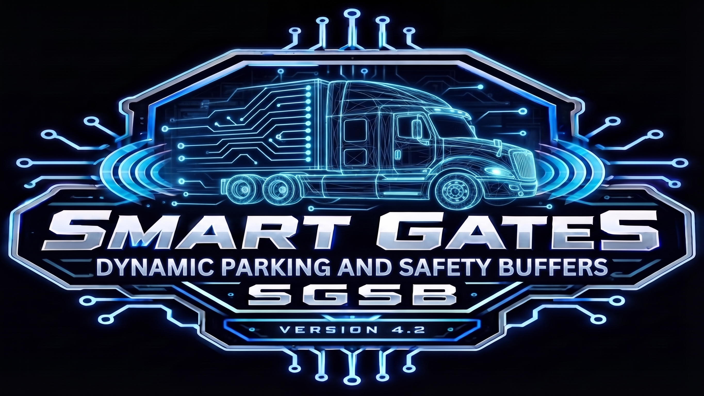

# Smart Gates, Dynamic Parking and Safety Buffers (SGSB)

**"The House That Code Built"*

## 📊 Official Release Information
* **Current Version:** v4.2.3.1-09426 (Hotfix)
* **Development Name:** Midnight Train (4.0 - 4.2.3)
* **ATS Compatibility:** v1.60.* branch (Until SCS breaks the core gate code and parked vehicles)
* **Development Environment:** Ubuntu 26.04 LTS
* Extracted by terminal by sk-zk Extractor tool
  * https://github.com/sk-zk/Extractor
* Official SCS Uploader tool running under Proton 
* **Architecture:** Pure definition-only (.sii) layout

---

## 📖 A Note from the Developer
This project is dedicated to the glory of God. Every mile driven and every line of code written is an expression of gratitude for the journey. May this mod bring a little more order, peace, and grace to the virtual highways we all travel. 

This is our first mod ever, so please extend us some grace! 
*— Built by a driver, for drivers.*

**Full Release Log & Source:** [GitHub Repository](https://github.com/insanity35/Smart-Gates-Parking-and-Safety-Buffers)

---

## 🛑 The Problem: "Gate Lag" & Sterile Truck Stops/Yards
For long-haul truckers across American Truck Simulator, immersion is everything. Nothing shatters the flow of a meticulous delivery faster than "gate lag"—that frustrating hitch at the yard threshold where you wait for a sluggish barrier to crawl open while your multi-ton rig idles out. Couple that with sterile, ghost-town truck stops, parking lots and getting flagged down at 60% of weigh stations. With that long-haul pacing takes a heavy hit.

## ✅ The Solution: Smart Gates & Safety Buffers
Smart Gates, Dynamic Parking and Safety Buffers (SGSB) is an environmental and traffic modification for American Truck Simulator designed to enhance the realism of rest stops, parking lots, loading zones, and world gate interactions.

## 🚦Smart Gate & Infrastructure Overhaul
Gate logic is key here. I have scanned every dlc for gate and gate properties. Unless it's a dumb prefab gates (see bottomfor examples). A guard house or toll gate to enter a yard or drop off those bad boys should already be open. From 17-25m on guard gates, border checks to 125-135m on every other gate.
   * Extended Trigger Ranges: Increased activation distances (125m for panoramas, custom industrial ranges) so gates open smoothly as you roll up, protecting your momentum.
   * Collider Fixes: Re-pointed broken base-game geometry files to proper colliders so multi-axle setups and heavy loads pass through without clipping.
   * Streamlined Logic: Purged legacy references, entirely focusing on automated gate routines, security checkpoints, and border crossings across all map DLCs.

## 🚛 Advanced Dynamic Parking System
Immerse yourself in a living roadside ecosystem. Parking lot, Rest stops and yards/drop off parked vehicle code has been completely rewritten. Everything will feel more realistic. As in no empty truck stops with two trucks at night or parking lots with one car in it are gone. 4.2 introduces a massive expansion across 39 granular industrial, commercial, and rural sectors:
 *  Context-Aware Spawning: Lots reflect their local environment—populating grain co-ops with farm pickups and classic sedans, marine ramps with trailer-towing haulers, and oilfields with heavy-duty service rigs.
 *   Hybrid Temporal Scheduling: Banishes the "mass-extinction" pop-in effect. Personal vehicles utilize controlled dawn and dusk bleed-over, while commercial and industrial fleets use strict deterministic shift separation.
 *   Operational Graveyard Shifts: Municipal fleets—including street sweepers and garbage trucks—truly own the overnight hours before clearing out for daytime traffic.
 *  Optimized VRAM Performance: Industrial yards and truck stops are densely populated without frame-rate hits, leveraging forced low-poly background rendering (low_poly_only: true).
 *   Precise Physical Alignment: Unattached yard trailers and heavy wreckers utilize strict rear_align: true protocols, ensuring assets lock securely onto pads without floating.

## ⚖️ Weigh Station Flow Control
Scale house checks have been reduced from the frustrating base-game default (60%) down to a realistic 20% check probability, ensuring smooth, uninterrupted pacing for your long-haul runs.

---

## ⚠️ Compatibility & Load Order

**Convoy-Ready:** Fully optimized file layout ensures seamless synchronization during multiplayer convoy sessions with zero mod-mismatch errors.  
**Map Compatibility:** Clean, definition-only architecture guarantees absolute stability alongside major map expansions like ProMods Canada, Reforma, and global traffic AI mods.

### Recommended Load Order
To ensure the custom safety buffer parameters take priority over world geometry data, organize your Mod Manager as follows:

* **— TOP —**
1. Background Maps
2. Smart Gates, Parking and Safety Buffers (SGSB) *(Notice: Needs to be ABOVE SoundFixes to keep hookups from being erased)*
3. SoundFixes
4. Global Traffic & AI Density Mods
5. Map Expansion Mods (ProMods, Reforma, etc.)
* **— BOTTOM —**

### Prefab Limitations (The "Hardcoded" Gates)
I cannot change values on prefab/hardcoded gates unless someone can teach me the ATS Map Editor. I cannot mess with prefab gates or "dumb gates". Ex:
* The following remain vanilla(so far):
* Army Gate next to O'Hare Airport (IL)
* Union Pacific Gate
* DOW Gate (IL)
* Group 1 Guard Gates (e.g., Coca-Cola in Albuquerque, General Mills in Roswell)

**Note on Toll Booths:** Tolls are a part of `tollgate.sii` and `gate_trigger.sii`. When I edit these, gated tolls fail to open. So as of now, Toll booths are stock.

**Conflict Notice:** This is a standalone global logic override. It will conflict with other mods that attempt to modify the same global gate animation or trigger definitions (`animated_gate` blocks).

---

## 📝 Support & Bug Reporting
If you encounter a specific yard, toll plaza, or logistics depot anywhere on the map that still feels "off" or doesn't trigger correctly, please drop the **City and Company Name** in the comments section. Feedback will be logged and prioritized for upcoming hotfixes.

---

## 🏆 Credits & Technical Acknowledgments
* **Development Group:** Smoke Show Studios, Smoke Show Creations & Harambes Children
* **Lead Developer & Tester:** meanshadows35
* **Technical Consultant:** Overdrive
* **Tester:** mrh368

A massive shout-out to our three-person team for pulling this together, and special thanks to the entire trucking community for the incredible passion and feedback.
* Developed natively on Ubuntu 26.04 LTS
* Thank you to SCS Software for letting us nod
* **Soli Deo Gloria**

---

## 📜 Complete Mod Release History

### v4.2.3.1-09426 (Hotfix)###
**Back to 48 categories**
* I got to fancy with car and truck calls reverted alot. State specific calls to ambulance police and fire still there.

### v4.2.3-09426 (Complete Fleet & Micro-Zone Release 1-85) ###
**Notes for users with missing state dlc**
Log Warnings: Operating without specific map or vehicle expansions will trigger non-fatal [parked_vehicle] warning entries in your game.log.txt as the engine encounters unowned tokens like regional state police or state-specific ambulance variants. These warnings are entirely harmless and will not cause crashes to desktop or corrupt saves. However, players who prefer a pristine compilation log can easily comment out or strip regional arrays (such as Sections 24 - 85)  if they lack the corresponding map expansions.** 
**Core Architectural Updates**
* Complete 1-85 Micro-Zone Integration: Fully standardizes all 85 distinct operational sectors—ranging from urban retail strips and highway rest stops to remote sawmill staging yards and international border queue lines.
* Unified Day/Night Probability Balancing: Re-calibrated day and night spawn multipliers (such as higher nighttime probabilities for rest stops and truck terminals, alongside reduced day multipliers for closed commercial yards) to ensure realistic temporal vehicle distribution.
**Specialized Facility Expansions**
* Industrial & Energy Hubs: Expanded distinct configurations for bulk fuel rack staging, oilfield extraction services, grain elevator uncoupled loading bins, and quarry aggregate operations.
* Emergency & Municipal Infrastructure: Integrated physics parameters for state patrol outposts, wildfire/forest incident command staging, municipal street sweepers, and regional medical center visitor lots. EX specific state name to police etc.
**Emergency & Municipal Fleet Updates**
* Populated state-specific emergency arrays (traffic.amb2.ca through traffic.amb2.ar) across regional medical, state patrol, and border inspection profiles.
* Integrated dedicated municipal equipment including traffic.fire_eng and traffic.ladder_trk into fire station and wildfire incident command staging.
* Modern Fleet & EV Integration: Added dedicated spawn logic for modern ATS truck expansions, electric vehicle (EV) charging stalls paired with appropriate passenger and hybrid units, and turnpike multi-trailer staging spurs.
**Physics, Lighting & Behavior Refinements**
* Granular Flare Control: Standardized forced_flare_low_beam, forced_flare_hooter, and forced_flare_blinker assignments to ensure parked emergency, service, and nighttime commercial units correctly display active lighting arrays.
* Driver & Alignment Toggles: Expanded the application of driver: true and rear_align: true tags across tow trucks, yard hostlers, and uncoupled yard trailers to fix backing alignments and visibility logic.
* Trailer Association Integrity: Refined strict filtering via allowed_trailer[] and exclude_vehicle[] arrays, eliminating cargo mismatch errors between flatbeds, lowboys, chipvans, livestock haulers, and specialized superload dollies.
**Performance & Asset Optimization**
Adaptive Low-Poly LOD Management: Fine-tuned low_poly_only parameters across all day, night, and stationary spawn definitions—retaining high-poly models strictly for close-range "always visible" zones while dynamically offloading distant, ambient, or daytime slots to low-poly assets to protect frame rates in dense terminal and city areas.

### v4.2.2-09326(Comprehensive Depot, Fleet & Lighting Audit Release) ###
* Comprehensive Depot & Fleet Audit: Re-evaluated and mapped vehicle-to-trailer allocations across all 48 specialized operational sections, aligning spawn logic with realistic logistics hubs (including agricultural co-ops, oilfield extraction, marine port authorities, and intermodal container yards).
* Lighting & Night-State Standardization: Implemented uniform forced_flare_low_beam parameters and auxiliary hooter flags (forced_flare_hooter) across night-time municipal, emergency, and commercial parked profiles to prevent unlit vehicle spawns during dark cycles.
* Probability & Performance Tuning: Adjusted day/night spawn weightings (probability_day and probability_night) and optimized low_poly_only / always_visible tags across high-density zones like truck stops, rest areas, and dealership lots to balance visual immersion and game performance.
* Expanded Specialized Fleets: Integrated fine-grained support for regional service vehicles, including updated Department of Transportation (DOT) utility arrays, Maintenance of Way (MoW) railroad trucks, federal forest service patrols, and multi-axle heavy dumper/lowboy configurations.
* AI Fallback & Driver Flag Refinements: Streamlined individual AI fallback blocks (ai.*) to ensure robust compatibility with base game and traffic pack expansions, while validating correct driver: true and rear_align assignments for delivery and recovery units.

### v4.2.1-09226 (Comprehensive Depot, Fleet & Lighting Audit Release) ###
* Section 1 (Delivery & Courier Expansion): Added traffic.pv_frosty and traffic.city_exp to package_van definitions to diversify small local freight hubs.
* Section 3 (Vintage Pool Polish): Added traffic.mercury and traffic.capr (Caprice) to classic vehicle blocks for broader historical variety.
* Section 5 (Performance Cars): Added traffic.mustang_2015 and traffic.charger to muscle car pools.
* Section 6 & 38 (Depot & Terminal Trailer Deep Audit): Expanded unattached yard trailers (yard_trl) and general freight trucks to include 45ft/53ft dry vans, reefers, drop-decks, silos, grain hoppers, and chipvans for realistic logistics park staging.
* Section 8 & 17 (Car Dealerships & Pickup Pools): Added traffic.sierra_hd and traffic.chevy_pickup across pickup categories, and expanded dealer_lot with luxury/sport models (cadillac_ats, c_escalade, accord).
* Section 10 & 19 (Agricultural & Ranching): Added grain hoppers (scs_hopper), livestock trailers (scs_livestock), and hay flatbeds (flatbed_b.cargo_hay).
* Section 11, 14, 16 & 21 (Industrial & LTL Freight): Integrated drop-decks (scs_dropdeck) for construction/materials yards, food-grade tanks (scs_foodtank) for cold chains, and 45ft dry vans for LTL distribution.
* Section 24 (Logging & Lumber Operations): Added chipvans (scs_chipvan) and lumber-loaded flatbeds (flatbed_r.cargo_beams) alongside raw log trailers.
Section 41 (Rural Residential Realism): Inverted farmhouse probabilities to 0.6 (Day) and 1.6 (Night) so vehicles are parked at home overnight.
* Section 43 (Truck Stop & Rest Area Overhaul): Expanded vehicle pool to 18 diverse cars, pickups, SUVs, minivans, and campers with tuned 1.5 (Day) and 1.8 (Night) probabilities.
* Section 44 (Auto Garages & Lighting Audit): Balanced day/night probabilities to 1.2 and removed forced_flare_low_beam so parked repair cars stay unlit overnight.
* Section 45, 46 & 48 (Scenic, Marina & Co-Op Pools): Broadened allowed vehicles for marinas, farm co-ops, and scenic tourist lookouts with appropriate towing and family vehicles.
* Section 49 (Fallback Alignment): Verified every active traffic vehicle class against its low-poly fallback unit to guarantee zero missing model console warnings.

### v4.2-82628 (Major Fleet & Physics Optimization Release)
**Updated the official mod title to Smart Gates, Dynamic Parking and Safety Buffers (SGSB), fully purging legacy toll references to focus exclusively on automated gates, dynamic yards, and roadside safety configurations.**
* Bumped project version to v4.2 (Major Fleet & Physics Optimization Release).
**Massive Industry & Prefab Expansion (Sections 10–48)**
* Added 39 granular, sector-specific configuration blocks to ensure pre-fabs spawn contextually accurate vehicle and trailer combinations:
* Industrial & Supply Chains: Deployed dedicated pools for agriculture depots, construction yards, energy logistics, chemical transport, refrigerated cold chains, intermodal containers, and timber operations.
* Municipal & Emergency: Built explicit spawn categories for fire and rescue, military defense, Department of Transportation (DOT) maintenance, border patrol, school buses, and heavy wreckers.
Roadside & Regional Outposts: Populated truck stop diners, scenic lookouts, boat ramps, RV campgrounds, scale houses, and farm co-op lots with fitting local traffic profiles.
* Standardized individual AI fallback profiles in Section 49 to enforce lightweight mesh rendering.
* Shift Probability Weights: Cleaned up to deterministic separation (active shift 1.5, inactive shift 0.0 or reduced nocturnal ratios).
* Yard Trailers (Section 38): Tuned daytime weight to 1.6 and night to 0.6 with mandatory rear_align: true.
* Lighting Flares: Standardized forced_flare_low_beam: true across all operational night-shift variants.
* **Performance & Low-Poly Architecture**
* Massively overhauled background and shift-based vehicle variants across all core sections by switching low_poly_only from false to true alongside always_visible: false, preventing VRAM spikes and stutter during heavy map mod loading.

### v4.1.4-82326 (Nighttime Fleet Density, AI Balance & Weight Stations)
* **NEW:** Weight Station Probability bumped from 60% to 20% to be more realistic.
* **AI Spawn Rebalance (Consumer Vehicles):** Reduced daytime/nighttime spawn probabilities for all Pickups and SUVs from 3.7 down to 3.5 to slightly reduce civilian clutter in industrial zones.
* **AI Spawn Rebalance (Commercial Vehicles):** Increased daytime/nighttime spawn probabilities for Commercial Delivery Vans from 1.0 up to 1.9 to boost local delivery traffic.
* **Environment Immersion (Truck Stops):** Doubled nighttime spawn probability for parked semi-truck fleets from 0.55 to 1.1. Truck stops and rest areas feel significantly more packed late at night.
* **Global Density Bump:** Applied a clean 7% spawn weight multiplier across all vehicle classes.
* **Broadened Time Windows:** Replaced hard 0.0 drop-offs with low "bleed-over" probability values across day and night cycles to eliminate dawn/dusk pop-ins.
* **Municipal Night Shift Flipped:** Reconfigured city sweepers and garbage trucks to own the graveyard shift (0.85 nighttime spawn probability).

### v4.1.3-82126
* **Gate Fixes & Adjustments:** Fixed collision parameters on `ag_nv_wstg` and `ag_suncrops` to point to proper `.pmc` collider files instead of geometry.
* **State Hookup Updates:** 
  * Standardized IL, NM, and TX panorama/traditional gates to 125.0 trigger distances.
  * Adjusted short-range pneumatic/industrial gates in KS, MT, OK, and WY to 17.0.
  * Fixed OR `metal_01` storage door from 50.0 to 135.0 to prevent late-opening clipping.
* **Parking Optimizations:** Forced all Section 9 AI fallback profiles to `low_poly_only: true` for massive performance improvements. Completely removed deprecated `traffic.tesla` from all lists.
* **Rebalancing Realism:** Inverted street sweeper spawn times (0.6 night / 0.3 day). Boosted daytime cars/police to 1.5. Tweaked daytime trucks combos to 0.85. Buffed daytime DHL vans and Garbage trucks. Nighttime limo spawns doubled.

### v4.1.2-81726
* **Animated Gate Spatial & Trigger Optimization:** Increased Group 1 cash toll triggers to 25.0m. Bumped security checkpoints to 20.0m. Fine-tuned Oregon Slide 4 gates to 33.0m.
* **Parked Vehicle Rebalance:** Separated generic package vans into dedicated FedEx (weight 3.0) and DHL (weight 0.5) profiles. Reduced spawn weights for sports cars, limousines, and municipal fleets. Increased budget/owner-operator semis to 1.5.

### v4.1.1-81526
* **Illinois DLC Fixes:** Updated underground gate variant to `ag_il_chund` to comply with engine naming rules.
* **Parked Vehicle Fixes:** Removed unsupported `forced_flare_parking: true` from night-time profiles to resolve engine startup errors.
* **Master Hookup:** Standardized sound references (`gate_iron.soundref`) across directional rotary and industrial gate groups.

### v4.1.0-81426 (Native Dynamic Parking)
* **New Feature:** Integrated a complete, custom-coded dynamically parked vehicle suite to permanently replace conflicting third-party mods.
* **Namespace Isolation:** Fully prefixed every unit definition
* **Advanced Logic:** Embedded native timing parameters and precise alignment tags.

### v4.0.5-81326
* **Extended Triggers:** Fine-tuned thresholds to accommodate long trailers and multi-axle setups without premature closure.
* **Stability:** Achieved a clean mount of 110 addon hookups with zero loading errors.
### v4.0.4-81126
* **Texas & Illinois additions:** Fixed/expanded gate ranges for TX regional cities, border checkpoints, and ports. Integrated IL underground gates and fences.
* **Universal Boost:** Pushed primary sliding and industrial gate distances to a uniform 135m.
### v4.0.3-81126
* **Expanded Core Security:** Optimized Group 3 gates with built-in trailer activation, 135m range, and 140-degree orientation tolerance.
* **Regional DLC Framework:** Maintained active mapping support across AR, IA, IL, KS, LA, MO, MT, and NE.
### v4.0-8726(Midnight Train)
* **Regional Audit:** Split DLC hookups into dedicated `animated_gate.dlc_*.sii` files to cut down log spam.
* **Behavioral Tuning:** Transitioned from uniform triggers to precise, environment-specific profiles (125m E-tolls, 20m cash lanes, 15m secure borders).

### v3.x Series Legacy Milestones (7/26/26-8/5/26) (Code barely worked till 3.2.2 when moved it unit/hookup code all went to 4.0)
* **v3.2.1:** Injected missing baseline assets (OK Turnpike, NE Farms, AR Timber Mills).(Internal beta turned into 4.0)
* **v3.2.0:** Stripped unverified "ghost code", optimized orientation tolerances, integrated state DLC coverage, and complete sound integration.
* **v3.1.0:** Moved deployment path to `unit/hookup/animated_gate.sii`. Reorganized into 25 clean function-based groups. Set logistics gates to 125m for 53ft trailer clearance.
* **v3.0.0 (PROJECT HEAVY FRUIT):** Systematically scaled up trigger distances globally. Expanded master index to incorporate specialized DLC assets (Groups 22-35). Built native compatibility layers for map mods like ProMods Canada and Reforma (Groups 36-50).

### v1.x & v2.x Series Legacy Milestones (6/1/26-7/26/26) (These barely worked)
* **v2.1.0:** Shifted toll plaza orientation to better clear high-speed approaches. Added missing pneumatic audio hooks.
* **v2.0.0 (Evolution):** Engine-native cleanse. Optimized logistics master triggers to 55m and 60° angle tolerances.
* **v1.7.0 (The House That Code Built):** Fully integrated native 1.60+ automatic rest distance mechanics. Fixed left-hand toll offset geometry for long-nose trucks.
* **v1.6.0 (Fight Fire with Code):** Fine-tuned EZ-Pass lanes to 23m triggers. Standardized borders to 25m.
* **v1.5.0 (For Whom the Code Tolls):** Added `trailer_activation: true` to every gate block to protect 53ft, double, and triple setups from early closure.
* **v1.1.0:** Expanded trigger distance baseline.
* **v1.0
---
