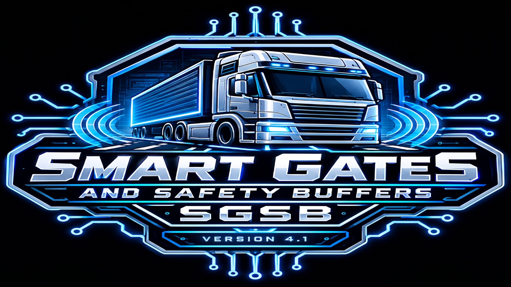

# Smart Gates, Parking and Safety Buffers (SGSB)
**v4.1.4-82326 (Midnight Train) — "The House That Code Built"**

---

## 📖 A Note from the Developer
This project is dedicated to the glory of God. Every mile driven and every line of code written is an expression of gratitude for the journey. May this mod bring a little more order, peace, and grace to the virtual highways we all travel. 

This is our first mod ever, so please extend us some grace! 
*— Built by a driver, for drivers.*

**Full Release Log & Source:** [GitHub Repository](https://github.com/insanity35/Smart-Gates-Parking-and-Safety-Buffers)

---

## 🛑 The Problem: "Gate Lag"
After years of long-haul trucking in American Truck Simulator, we know that immersion is everything. Nothing kills the flow of a delivery faster than "gate lag"—that frustrating moment when you are at the yard threshold, waiting for a barrier to crawl open while your multi-ton rig is already stalled out. 

## ✅ The Solution: Smart Gates & Safety Buffers
SGSB is the definitive logic overhaul for gate operations. We have stripped away the inconsistent, immersion-breaking triggers of the base game and replaced them with a standardized, high-performance logic set. Whether you are hauling heavy cargo into a Phoenix warehouse or navigating a tight depot in the Midwest, your gates will now respond with the reliable precision a professional driver expects.

### 🚛 Native Dynamic Parking System (New in v4.1)
Version 4.1 introduces a built-in, native dynamic parking framework engineered completely from scratch for SGSB. Designed to eliminate legacy mod conflicts, this standalone system utilizes custom-isolated namespaces to manage rest area slot snapping, high-precision company loading bay alignment, and weigh station queue spacing. It integrates seamlessly with your map configurations and ATS parking settings, delivering enhanced realism and fluid staging entirely on its own engine logic.

### ⚖️ Weigh Station Flow Control (New in v4.1.4)
Scale house checks have been dropped from the frustrating base-game default (60%) down to a highly realistic **20% check probability** for smoother long-haul pacing.

---

## 📊 Official Release Information
* **Current Version:** v4.1.4-82326 (Midnight Train) (Stable)
* **Official Launch Date (v1.0):** Tuesday, July 14, 2026
* **ATS Compatibility:** v1.60.* branch (Until SCS breaks the core gate code)
* **Development Environment:** Ubuntu 26.04 LTS via Linux
* **Architecture:** Pure definition-only (.sii) layout

---

## ⚙️ Engine Optimization (Highly Recommended)
To get the absolute best visual experience out of the parking density, open your game's `config.cfg` file (or use the developer console) and apply this parameter:

`uset g_lod_factor_parked "1.1"`

*This establishes the optimal draw distance setting to pull background parked vehicle culling out just far enough to catch assets before entering your immediate field of view, without tanking your FPS or VRAM.*

---

## ⚠️ Compatibility & Load Order

**Convoy-Ready:** Fully optimized file layout ensures seamless synchronization during multiplayer convoy sessions with zero mod-mismatch errors.  
**Map Compatibility:** Clean, definition-only architecture guarantees absolute stability alongside major map expansions like ProMods Canada, Reforma, and global traffic AI mods.

### Recommended Load Order
To ensure the custom safety buffer parameters take priority over world geometry data, organize your Mod Manager as follows:

**— TOP —**
1. Background Maps
2. **SGSB (Notice: Needs to be ABOVE SoundFixes for custom gate sound files!)**
3. SoundFixes
4. Global Traffic & AI Density Mods
5. Map Expansion Mods (ProMods, Reforma, etc.)
**— BOTTOM —**

### Prefab Limitations (The "Hardcoded" Gates)
I cannot change values on prefab/hardcoded gates unless someone can teach me the ATS Map Editor. I cannot mess with prefab gates or "dumb gates". The following remain vanilla:
* Army Gate next to O'Hare Airport (IL)
* Union Pacific Gate
* DOW Gate (IL)
* Group 1 Guard Gates (e.g., Coca-Cola in Albuquerque, General Mills in Roswell)

**Note on Toll Booths:** Tolls are a part of `tollgate.sii` and `gate_trigger.sii`. When I edit these, gated tolls fail to open. So as of now, Toll booths are stock.

**Conflict Notice:** This is a standalone global logic override. It will conflict with other mods that attempt to modify the same global gate animation or trigger definitions (`animated_gate` blocks).

---

## 📝 Support & Bug Reporting
If you encounter a specific yard, toll plaza, or logistics depot anywhere on the map that still feels "off" or doesn't trigger correctly, please drop the **City and Company Name** in the comments section. Feedback will be logged and prioritized for upcoming hotfixes.

---

## 🏆 Credits & Technical Acknowledgments
* **Development Group:** Smoke Show Studios, Smoke Show Creations & Harambes Children
* **Lead Developer & Tester:** meanshadows35
* **Co-Developer:** mrh368
* **Technical Consultant:** Overdrive

A massive shout-out to our three-person team for pulling this together, and special thanks to the entire trucking community for the incredible passion and feedback.
* Developed natively on Ubuntu 26.04 LTS
* Mod testing powered by the sk-zk Extractor tool
* Built using the official SCS Uploader tool running under Proton
* Thank you to SCS Software for the robust modding ecosystem

**Soli Deo Gloria**

---
---

## 📜 Complete Mod Genesis & Release History

### The Early Development Phase (June/July 2026)
* **June 2026 [Alpha Phase: Extraction & Mapping]:** Natively developed on Ubuntu 26.04. Utilized the sk-zk Extractor tool to dissect def.scs and base.scs. Performed a deep-dive code analysis to map game logic specifically within animated_gate blocks and identify critical trigger/reset dependencies.
* **July 10–11, 2026 [Beta Testing: Stress Testing the Framework]:** Field-tested across high-density industrial hubs in Phoenix and Stockton. Confirmed 100% Convoy-ready multiplayer compatibility with zero "mod-mismatch" errors.
* **July 11–14, 2026 [Release Candidate 1.0: Real-World Discoveries]:** Implemented a standardized 47m trigger distance for all industrial yard gates to ensure full clearance for double and triple trailer combinations. Discovered during a vacation road trip that the engine handles rest distances automatically now; native reset code remains commented out until v1.7.
* **July 14, 2026 [Version 1.0.0: Public Launch]:** Initial public release. Successfully moved gate trigger zones significantly further away from the physical frames.

---

### v4.1.4-82326 (Nighttime Fleet Density, AI Balance & Weight Stations)
* **NEW:** Weight Station Probability bumped from 60% to 20% to be more realistic.
* **AI Spawn Rebalance (Consumer Vehicles):** Reduced daytime/nighttime spawn probabilities for all Pickups and SUVs from 3.7 down to 3.5 to slightly reduce civilian clutter in industrial zones.
* **AI Spawn Rebalance (Commercial Vehicles):** Increased daytime/nighttime spawn probabilities for Commercial Delivery Vans from 1.0 up to 1.9 to boost local delivery traffic.
* **Environment Immersion (Truck Stops):** Doubled nighttime spawn probability for parked semi-truck fleets from 0.55 to 1.1. Truck stops and rest areas feel significantly more packed late at night.
* **Global Density Bump:** Applied a clean 7% spawn weight multiplier across all vehicle classes.
* **Broadened Time Windows:** Replaced hard 0.0 drop-offs with low "bleed-over" probability values across day and night cycles to eliminate dawn/dusk pop-ins.
* **Municipal Night Shift Flipped:** Reconfigured city sweepers and garbage trucks to own the graveyard shift (0.85 nighttime spawn probability).

### v4.1.3-82126
* **Gate Fixes & Adjustments:** Fixed collision parameters on `ag_nv_wstg` and `ag_suncrops` to point to proper `.pmc` collider files instead of geometry.
* **State Hookup Updates:** 
  * Standardized IL, NM, and TX panorama/traditional gates to 125.0 trigger distances.
  * Adjusted short-range pneumatic/industrial gates in KS, MT, OK, and WY to 17.0.
  * Fixed OR `metal_01` storage door from 50.0 to 135.0 to prevent late-opening clipping.
* **Parking Optimizations:** Forced all Section 9 AI fallback profiles to `low_poly_only: true` for massive performance improvements. Completely removed deprecated `traffic.tesla` from all lists.
* **Rebalancing Realism:** Inverted street sweeper spawn times (0.6 night / 0.3 day). Boosted daytime cars/police to 1.5. Tweaked daytime trucks combos to 0.85. Buffed daytime DHL vans and Garbage trucks. Nighttime limo spawns doubled.

### v4.1.2-81726
* **Animated Gate Spatial & Trigger Optimization:** Increased Group 1 cash toll triggers to 25.0m. Bumped security checkpoints to 20.0m. Fine-tuned Oregon Slide 4 gates to 33.0m.
* **Parked Vehicle Rebalance:** Separated generic package vans into dedicated FedEx (weight 3.0) and DHL (weight 0.5) profiles. Reduced spawn weights for sports cars, limousines, and municipal fleets. Increased budget/owner-operator semis to 1.5.

### v4.1.1-81526
* **Illinois DLC Fixes:** Updated underground gate variant to `ag_il_chund` to comply with engine naming rules.
* **Parked Vehicle Fixes:** Removed unsupported `forced_flare_parking: true` from night-time profiles to resolve engine startup errors.
* **Master Hookup:** Standardized sound references (`gate_iron.soundref`) across directional rotary and industrial gate groups.

### v4.1.0-81426 (Native Dynamic Parking)
* **New Feature:** Integrated a complete, custom-coded dynamically parked vehicle suite to permanently replace conflicting third-party mods.
* **Namespace Isolation:** Fully prefixed every unit definition (e.g., `sgsb.suv.always.parked.physics`) to eliminate base-game naming collisions.
* **Advanced Logic:** Embedded native timing parameters and precise alignment tags (`rear_align`) to handle automated cycles and dock-backing behavior.

### v4.0.5-81326
* **Extended Triggers:** Fine-tuned thresholds to accommodate long trailers and multi-axle setups without premature closure.
* **Stability:** Achieved a clean mount of 110 addon hookups with zero loading errors.

### v4.0.4-81126
* **Texas & Illinois additions:** Fixed/expanded gate ranges for TX regional cities, border checkpoints, and ports. Integrated IL underground gates and fences.
* **Universal Boost:** Pushed primary sliding and industrial gate distances to a uniform 135m.

### v4.0.3-81126
* **Expanded Core Security:** Optimized Group 3 gates with built-in trailer activation, 135m range, and 140-degree orientation tolerance.
* **Regional DLC Framework:** Maintained active mapping support across AR, IA, IL, KS, LA, MO, MT, and NE.

### v4.0.2 to v4.0 (Midnight Train)
* **Regional Audit:** Split DLC hookups into dedicated `animated_gate.dlc_*.sii` files to cut down log spam.
* **Behavioral Tuning:** Transitioned from uniform triggers to precise, environment-specific profiles (125m E-tolls, 20m cash lanes, 15m secure borders).

### v3.x Series Legacy Milestones
* **v3.2.1:** Injected missing baseline assets (OK Turnpike, NE Farms, AR Timber Mills).
* **v3.2.0:** Stripped unverified "ghost code", optimized orientation tolerances, integrated state DLC coverage, and complete sound integration.
* **v3.1.0:** Moved deployment path to `unit/hookup/animated_gate.sii`. Reorganized into 25 clean function-based groups. Set logistics gates to 125m for 53ft trailer clearance.
* **v3.0.0 (PROJECT HEAVY FRUIT):** Systematically scaled up trigger distances globally. Expanded master index to incorporate specialized DLC assets (Groups 22-35). Built native compatibility layers for map mods like ProMods Canada and Reforma (Groups 36-50).

### v2.x & v1.x Series Legacy Milestones
* **v2.1.0:** Shifted toll plaza orientation to better clear high-speed approaches. Added missing pneumatic audio hooks.
* **v2.0.0 (Evolution):** Engine-native cleanse. Optimized logistics master triggers to 55m and 60° angle tolerances.
* **v1.7.0 (The House That Code Built):** Fully integrated native 1.60+ automatic rest distance mechanics. Fixed left-hand toll offset geometry for long-nose trucks.
* **v1.6.0 (Fight Fire with Code):** Fine-tuned EZ-Pass lanes to 23m triggers. Standardized borders to 25m.
* **v1.5.0 (For Whom the Code Tolls):** Added `trailer_activation: true` to every gate block to protect 53ft, double, and triple setups from early closure.
* **v1.1.0:** Expanded trigger distance baseline.

---
