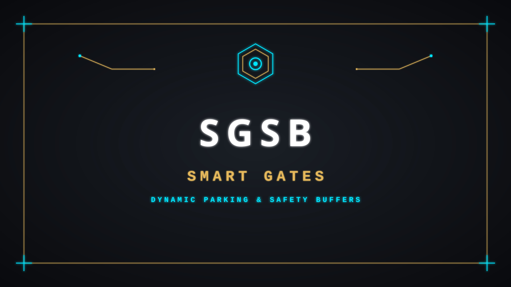

# Smart Gates, Dynamic Parking and Safety Buffers (SGSB)
**"The House That Code Built"*

## 📊 Official Release Information
* **Current Version:** 26.10.161RT2 (Road Trippin) (Stable)
* **Development Name:** Golden Age (26.9.161)
* **ATS Compatibility:** v1.61.* branch (Until SCS breaks the core gate code and parked vehicles)
* **Development Environment:** Ubuntu 26.04.1 LTS
* Extracted by terminal by sk-zk Extractor tool
  * https://github.com/sk-zk/Extractor
* Official SCS Uploader tool running under Proton 
* **Architecture:** Pure definition-only (.sii) layout

---

## 📖 A Note from the Developer
This project is dedicated to the glory of God. Every mile driven and every line of code written is an expression of gratitude for the journey. May this mod bring a little more order, peace, and grace to the virtual highways we all travel. 

This is our first mod ever, so please extend us some grace! 
*— Built by a driver, for drivers.*

**Full Release Log & Source:** [GitHub Repository](https://github.com/insanity35/Smart-Gates-Parking-and-Safety-Buffers)

---

## 🛑 The Problem: "Gate Lag" & Sterile Truck Stops/Yards
For long-haul truckers across American Truck Simulator, immersion is everything. Nothing shatters the flow of a meticulous delivery faster than "gate lag"—that frustrating hitch at the yard threshold where you wait for a sluggish barrier to crawl open while your multi-ton rig idles out. Couple that with sterile, ghost-town truck stops, parking lots and getting flagged down at 60% of weigh stations. With that long-haul pacing takes a heavy hit.

## ✅ The Solution: Smart Gates & Safety Buffers
Smart Gates, Dynamic Parking and Safety Buffers (SGSB) is an environmental and traffic modification for American Truck Simulator designed to enhance the realism of rest stops, parking lots, loading zones, and world gate interactions.

## 🚦Smart Gate & Infrastructure Overhaul
Gate logic is key here. I have scanned every dlc for gate and gate properties. Unless it's a dumb prefab gates (see bottom for examples). From 17-25m on guard gates, border checks to 125-135m on every other gate.
   * Extended Trigger Ranges: Increased activation distances (125m for panoramas, custom industrial ranges) so gates open smoothly as you roll up, protecting your momentum.
   * Collider Fixes: Re-pointed broken base-game geometry files to proper colliders so multi-axle setups and heavy loads pass through without clipping.
   * Streamlined Logic: Purged legacy references, entirely focusing on automated gate routines, security checkpoints, and border crossings across all map DLCs.

## 🚛 Advanced Dynamic Parking System
Immerse yourself in a living roadside ecosystem. Parking lots, rest stops, yards, and drop-off parked_trailer and vehicle codes have been completely rewritten. Everything will feel more realistic—empty truck stops with two random trucks at night or barren parking lots are a thing of the past. SGSB introduces a massive expansion across 90 granular industrial, commercial, and rural sectors:
* Context-Aware Spawning: Lots reflect their local environment—populating grain co-ops with farm pickups and classic sedans, marine ramps with trailer-towing haulers, and oilfields with heavy-duty service rigs. 
* Hybrid Temporal Scheduling: Banishes the "mass-extinction" pop-in effect. Personal vehicles utilize controlled dawn and dusk bleed-over, while commercial and industrial fleets use strict deterministic shift separation.
* Operational Graveyard Shifts: Municipal fleets—including street sweepers and garbage trucks—truly own the overnight hours before clearing out for daytime traffic.
* Optimized VRAM Performance: Industrial yards and truck stops are densely populated without frame-rate hits, leveraging forced low-poly background rendering (low_poly_only: true).
* Precise Physical Alignment: Unattached yard trailers, parked trailers, and heavy wreckers utilize strict alignment protocols (rear_align: true, parked_trailer), ensuring assets lock securely onto pads without floating.

## ⚖️ Weigh Station Flow Control
Scale house checks have been reduced from the frustrating base-game default (60%) down to a realistic 20% check probability, ensuring smooth, uninterrupted pacing for your long-haul runs.

---

## ⚠️ Compatibility & Load Order

**Convoy-Ready:** Fully optimized file layout ensures seamless synchronization during multiplayer convoy sessions with zero mod-mismatch errors.  
**Map Compatibility:** Clean, definition-only architecture guarantees absolute stability alongside major map expansions like ProMods Canada, Reforma, and global traffic AI mods.
**Edits
unit/hookup/parked_vehicle.sii
unit/hookup/parked_trailer.sii
unit/hookup/animated_gate.sii
def/world/trigger_action.sii

### Recommended Load Order
To ensure the custom safety buffer parameters take priority over world geometry data, organize your Mod Manager as follows:

* **— TOP —**
1. Background Maps
2. Smart Gates, Parking and Safety Buffers (SGSB) *(Notice: Needs to be ABOVE SoundFixes to keep hookups from being erased)*
3. SoundFixes
4. Global Traffic & AI Density Mods
5. Map Expansion Mods (ProMods, Reforma, etc.)
* **— BOTTOM —**

### Prefab Limitations (The "Hardcoded" Gates)
I cannot change values on prefab/hardcoded gates unless someone can teach me the ATS Map Editor. I cannot mess with prefab gates or "dumb gates". Ex:
* The following remain vanilla(so far):
* Army Gate next to O'Hare Airport (IL)
* Union Pacific Gate
* DOW Gate (IL)
* Group 1 Guard Gates (e.g., Coca-Cola in Albuquerque, General Mills in Roswell)
* Most newer dlcs especially Illinois and now South Dakota have gone with prefab gates.

**Note on Toll Booths:** Tolls are a part of `tollgate.sii` and `gate_trigger.sii`. When I edit these, gated tolls fail to open. So as of now, Toll booths are stock.

**Conflict Notice:** This is a standalone global logic override. It will conflict with other mods that attempt to modify the same global gate animation or trigger definitions (`animated_gate` blocks).

---

## 📝 Support & Bug Reporting
If you encounter a specific yard, toll plaza, or logistics depot anywhere on the map that still feels "off" or doesn't trigger correctly, please drop the **City and Company Name** in the comments section. Feedback will be logged and prioritized for upcoming hotfixes.

---

## 🏆 Credits & Technical Acknowledgments
* **Development Group:** Smoke Show Studios, Smoke Show Creations & Harambes Children
* **Lead Developer & Tester:** meanshadows35
* **Technical Consultant:** Overdrive

A massive shout-out to our three-person team for pulling this together, and special thanks to the entire trucking community for the incredible passion and feedback.
* Developed natively on Ubuntu 26.04.1 LTS
* Thank you to SCS Software for letting us nod
* **Soli Deo Gloria**

---

## 📜 Complete Mod Release History

### v26.10.161RT2 (930-1750-Road Trip Hotfix 2)
* Fixed car mode not letting you sleep or even showing rest icons on map.

### v26.10.161RT1 (930-1230-Road Trippin HOTFIX1) ###
* Removed Ford Road Trip car pack from parked files. Parser error. Ive removed them till i have time to build them into AI vehicles. SCS never included them so my calls do nothing but give an error. Sorry Folks...Ill Work on this if someone knows how to add none AI cars please drop me a message.

### v26.10.161 (9/29-1830 Final - Road Trippin) ### 
---
## 🏗️ 1. ATS 1.61 Compatibility, Core Features & Road Trip DLC Integration
* **ATS 1.61 Engine & World Integration:** Full support for the new ATS 1.61 update, including the Proximity Exploration feature for hidden roads and the advanced lighting/material shader system expanded to the International LT and LoneStar trucks.
* **Project Road Trip & Ford DLC Framework:** Integrated foundational support for the new Road Trip career module and the **Road Trip: Ford DLC**, adding custom spawn compatibility and categorization for the official vehicle fleet:
  * **1967 Ford Mustang Fastback** (Classic muscle/pony car)
  * **2023 Ford F-150** (Modern light-duty utility & work truck)
  * **2023 Ford Bronco Badlands** (Off-road SUV)
  * **1998–2012 Ford Crown Victoria** (Full-size sedan / municipal veteran)
* **Official Soda Ash Gate Integration:** Added official ATS 1.61 mining and industrial asset hookups into Company & General Industrial Gates (`[GROUP 5]`):
  * `anim_gate.soda_ash` (Linked model: `/model/props/street/tollgate_soda_ash_gate_anim.pmd`)
  * `anim_gate.soda_ash2` (Linked model: `/model/props/street/tollgate_soda_ash_gate_anim2.pmd`)
* **Gate Logic & Safety Enhancements:** Enabled `trailer_activation: true` across new soda ash gates to prevent premature closing collisions on multi-axle lowboys and heavy-haul trailers, paired with standard iron gate sound references (`/sound/world/gate_iron.soundref`) and tuned trigger orientations.
* **Strict Vanilla Compliance:** Corrected low-cab flatbed definitions to strictly utilize native 1.61 SCS vehicle tokens (`traffic.lowcab_fbed1`, `traffic.lowcab_fbeds`), ensuring zero reliance on external mods and eliminating missing unit warnings.
---
## 🚛 2. Standalone `parked_trailer.sii` Overhaul
To transform static industrial lots into living, realistic environments, the standalone trailer framework has been fully modernized:

* **Shift-Based RNG Logic:** Stripped out static `always_visible: true` tags and injected `probability_day` and `probability_night` variables. Yards physically empty out during daytime working hours to simulate dispatches and fill up with staged freight at night.
* **Purposeful Cargo Filtering:** Removed base-model empty references from heavy industry pools, restricting `allowed_trailer[]` lists exclusively to cargo-suffixed variants (machinery, livestock, and material loads).
* **Vanilla Overwrite Strategy:** Hijacked hardcoded vanilla identifiers (such as `trailer.parked.construction.always`) so dynamic rules apply globally to every existing map prefab without requiring custom Map Editor placement.
* **Modular Architecture:** Cleaned arrays and restructured the codebase into 9 distinct industry categories (Groceries, Containers, Farm, Logging, Construction, Logistics, Fuel, Automotive, Generic) with standardized UI header boundaries.
---
## 🚚 3. Fleet Additions, Commercial Expansion & Comprehensive World Mapping
* **Commercial & Delivery Expansion:** Added daytime delivery van spawns (Transit cargo/ladder, City Express, Chevy Van, Box Truck, Lowcab Delivery) to Parcel Courier Hubs (`[Section 14]`), Strip Malls (`[Section 82]`), and Retail Mix (`[Section 81]`).
* **Construction & Industrial Overhaul:** Integrated missing low-cab variants (dump, dump trailer, flatbed) and transit cargo/ladder configurations to daytime parking at Construction Yards (`[Section 10]`), Material Yards (`[Section 15]`), Quarries (`[Section 17]`), and Road Construction zones (`[Section 77]`).
* **Vintage & Classic Car Integration:** Injected native vintage vehicle models (1951 Oldsmobile, Cadillac DeVille, Mercury, Chevy Caprice) across all visibility states (Always, Day, Night) for Rural Residential (`[Section 40]`), Rural Properties (`[Section 41]`), Rest Stops (`[Section 43]`), Motels & Lodges (`[Section 80]`), and Retail Lots (`[Section 81]`).
* **Vocational & Municipal Fleet:** Fully integrated utility reel service variants (`traffic.lowcab_r_p1/p2`, `c1/c2`, `d1/d2`, `t1/t2`, `b1/b2`), concrete pumpers (`traffic.mack_rd.pump`), cistern tankers (`traffic.mack_rd.ccistern`), and street sweepers (`traffic.sweeper`).
* **Comprehensive Ford & Vehicle Hub Allocation:** Mapped the new Ford vehicle lineup and expanded fleets across targeted environments:
  * *Gas Stations & Convenience Hubs:* Universal stopover staging for all Fords and daily commuters.
  * *Retail Shopping Centers & Strip Malls:* F-150, Crown Victoria, Mustang, and Bronco Badlands.
  * *Rest Stops & Motels / Highway Lodges:* Overnight slots featuring classic cruisers, off-roaders, and traveler pickup trucks.
  * *Driveways & Residential Clusters:* Lived-in neighborhood and rural driveway layouts.
  * *Industrial Work Sites & Logistics Yards:* F-150 supervisor and contractor transport.
  * *Farm Co-Ops & Agricultural Properties:* F-150 utility trucks and Bronco SUVs.
  * *Trailheads, Scenic Overlooks & Nature Reserves:* Bronco and F-150 off-road/outdoor staging.
  * *Service Garages & Local Repair Shops:* F-150, Bronco, Mustang, and Crown Victoria filling maintenance bays and project slots.
  * *Car Dealerships & Showrooms:* Vehicle transfers and display staging.
---
## ⚙️ 4. Technical Fixes, Lighting & Physics Refinements
* **ATS Unit Name Character Limit Enforcement:** Resolved critical game loading crashes by adhering to the hardcoded ATS engine rule stating that **every dot-separated token segment in a unit name cannot exceed 12 characters**:
  * Shortened Section 86 prefix from `ind_warehouse` (13 characters) to `ind_wrhs`.
  * Shortened Section 87 prefix from `county_turnout` (14 characters) to `c_turnout`.
  * Verified clean initialization with 0 unit parsing or syntax errors in `game.log.txt`.
* **Ghost Headlights Scrubbed:** Removed `forced_flare_low_beam: true` from civilian/parked `.night` blocks (Sections 2, 8, 40, 41, 47, and 80) to stop unlit parked vehicles from projecting active night beams. Retained exclusively on active emergency vehicles, scale queues, and monitored operational stops.
* **Trailer Mesh Alignment Injected:** Added `rear_align: true` to mixed trailer nodes and heavy transport blocks (Sections 6, 68, 70, and 87) to prevent center-spawning meshes from clipping through adjacent prefabs, docks, or spawn points.
* **Probability Tuning Maintained:** Preserved mutually exclusive day/night spawn probabilities across all altered sections, ensuring flawless dynamic parking transitions across the simulation clock without over-populating localized environments.
* **Syntax & Value Adjustments:**
  * Added missing spacing to `probability_night: 2.0` in Section 10 (`const_truck.parked.physics.night`) for strict parser compatibility.
  * Renamed Section 8 limo blocks from `limo.always.parked...` to `limo.parked.physics.day` and `limo.parked.physics.night` to accurately reflect their `always_visible: false` state.
  * Capped `moto.parked.physics.day` in Section 54 down to `3.0` to eliminate double-roll and mesh-overlapping risks in tight parking slots.
---
## 📐 5. Technical Mechanics Reference (`parked_trailer` vs. `parked_vehicle`)
* **Dedicated Trailer Slots:** Standalone trailer spawns pull explicitly from `allowed_trailer[]` definitions rather than `allowed_vehicle[]`, locking them to appropriate industry yards (terminals, silos, container depots).
* **The `rear_align: true` Rule:** Because trailers spawn uncoupled without a cab, this flag forces the game engine to anchor the kingpin and rear alignment against invisible prefab parking boxes—stopping them from spawning sideways or floating inside fences.
* **State Control:** Strict syntax parameters ensure low-poly freight variants remain isolated to industrial zones, preventing out-of-place dry vans or flatbeds from appearing in civilian areas.

### v26.9.161-1 (9/21/26) (The Great RAMbase) ###
* In preparation for South Dakota im pushing a massive fix for trucks and trailers sticking out of fences at dealships and repair shops.
* Ram Ram Rams!! Added Rams and Featan to more categories
* Wyoming Hookup Cleanup:** Removed the legacy Wyoming gate definitions (`ag_wy_indep`, `ag_wy_riv`, `ag_wy_jack`, `ag_wy_ref`) from the master file. Because version 1.61 now bakes these specific native definitions directly into the core game archives, removing them prevents fatal duplicate unit crash errors while still allowing the game engine to call them naively.
* *Motorcycle Spawn Rebalancing (Sec 56):** Increased overall motorcycle presence in designated lots (Day probability bumped to 3.0; Night to 0.8).
* Core Def Cleanup:** Audited and resolved missing parsed vehicle definition strings across triggers.
* Zero-Dependency Guarantee:** Verified all injected vehicle spawn strings use 100% vanilla SCS definitions for zero log warnings.

### v26.9.161 (9/15/26) (1.61 Rebase & Pre-South Dakota Release)

**📌 Versioning Update & Rationale**

* Format Shift to 26.9.161: Updated the mod versioning scheme to directly mirror the ATS game patch version (1.61), providing clearer tracking for players and ensuring compatibility alignment.
* Staging & Expansion Roadmap: Maintained 26.9.161 as the pre-release staging baseline, keeping it clean ahead of the upcoming South Dakota DLC release (where it will transition to 26.9.161SD or 26.9.161-1).

**🚗 New Vehicle Integration & Hybrid Pools**

* Modern Pickups & SUVs: Integrated traffic.featan.pickup.midclass_25, traffic.caliber.suv.premium_23, and traffic.tt_pickup into primary hybrid spawn pools, including Rest Stops (rest_stop), Retail Mix (retail_mix), Motel parking lots, and Marina/Boat ramps.
* Electric & Hybrid Lineup: Added the traffic.voltison_r and traffic.voltse models into EV Charging stations (ev_charger), Sport Car pools, and Low-Cost/Fast Food parking configurations.
* Broadcast & News Media: Created dedicated tracking for news network vans (traffic.transit_16.cbn and traffic.transit_16.fox) with specialized day and night weighting rules.
* Package Vans & Work Cabs: Added the new package van variant (traffic.pv_mw) to courier hubs and integrated vocational work cabs (hoodcabdumpd, traffic.ladder, etc.) into Section 8 work fleets.

**🛡️ Specialized Zone & Agency Fleet Enhancements**

* Section 36 (Border Inspection & Weigh Stations): Added traffic.featan.pickup.midclass_25 into border and customs outpost spawn pools.
* Section 46 (Scale Master & Weight Enforcement): Integrated traffic.caliber.suv.premium_23 to modernize state agency and inspector vehicle lots alongside existing Crown Vics and Explorers.
* Section 73 (Wildfire & Incident Command Staging): Added traffic.featan.pickup.midclass_25.maintenance service utility trucks to forestry and emergency response staging clusters.

**🛠️ Structure & Engine Fallback Fixes**

* Section 48 Fallback Additions: Appended all missing single-vehicle AI fallback definitions (ai.voltse22, ai.calsuvpre23, ai.voltison_r.factory, ai.voltse.factory, and ai.featan.pickup.midclass_25) to prevent missing unit errors in game.log.txt.
* Standalone Profiles: Built dedicated profile blocks for all new 1.61 vehicles complete with independent day/night probabilities, low_poly_only optimizations, and nighttime lighting flares.

### v4.2.7-091426 (Hybrid Pools & Parking Variety Tweak) ###
**Global Spawn Density Tuning**
* 10% Parking Bump: Applied an upward density adjustment to `probability_day` and `probability_night` values across core parked vehicle physics profiles to ensure lots populate more naturally during peak midday hours without feeling unnaturally oversaturated.
* Ratio Integrity: Preserved individual behavioral flags (such as low-beam lighting, driver toggles, and rear-align parameters) while elevating overall vehicle appearance frequency.

**Hybrid Retail & Convenience Store Pools (`retail_mix` & `conv_store`)**

* Clone Elimination: Replaced single-vehicle definition blocks in retail zones with broad, multi-class hybrid pools. Parking stalls now dynamically roll between compacts, sedans, SUVs, and pickup trucks.
* Jeep Wrangler Integration: Officially added the vanilla Jeep Wrangler (`traffic.jeep_w`) into both the convenience store (`conv_store`) and the broader retail mix (`retail_mix`) arrays for added variety.

**Expanded Auto Repair & Service Garages (`repair_trk` — Section 43)**

* Authentic Customer Traffic: Upgraded Section 43 with a comprehensive hybrid vehicle array to simulate real-world customer drop-offs and shop activity.
* Expanded Roster: Blended daily drivers, classic models (like the Oldsmobile), service vans, heavy-duty pickups (RAM, F-150, Sierra HD), SUVs, and the Jeep Wrangler into the garage bay pool.

**Specialized Environment Pools**

* Motel & Highway Lodges (`motel_lodge`): Grouped out-of-town vehicle profiles, full-size SUVs, campers, and transit vans to simulate overnight guests parked outside their rooms.
* Fast-Food Drive-Thrus (`fast_food`):** Configured quick-service lots with daily drivers, compacts, and light trucks to accurately mirror lunch rushes and queue areas.

**Nighttime Lighting & Metadata**

* Illumination Rules: Maintained strict `forced_flare_low_beam: true` configurations across all evening and nighttime hybrid blocks for correct lighting behavior after dark.
* Mod Manager Tracking: Incremented internal version headers to designate **4.2.7 (Hybrid Pools & Parking Variety Tweak)** for clean version control.

### v4.2.6-091126(Spawn Tweaks) ###
**Daytime Multipliers** 
* Fine-tuned active daytime probability ranges up to 2.0 – 2.5 across standard transport, commercial units, rest stops, and scenic pull-offs.
**Nighttime Multipliers** 
* Adjusted overnight rest slots, queues, and industrial night rates to range between 0.4 and 2.4.
**Starting with 1.61/South Dakota rebase, all versions will follow year.month.ats version-hotfix**

### v4.2.5-09526 (Vanilla-Cleaned Parking Definitions) ###
**Stripped parking_trailer.sii I cannot get it to work**
* Vanilla Traffic Compliance: Stripped all obsolete, modded, or non-native vehicle strings from all 85 parking and gate sections, ensuring the package exclusively utilizes standard American Truck Simulator base assets.
* Category Structure Preservation: Maintained all 85 functional distribution zones—including commercial depots, agricultural lots, industrial facilities, and roadside rest areas—without altering underlying hierarchy arrays or category bindings.
* Optimized Day/Night Spawn Weight Balance: Adjusted operational probability weights between daylight hours and nighttime intervals (such as peak night multipliers of 2.0 for rest stops and 1.8 for rural entries) to accurately simulate real-world logistics parking behavior.
* Lighting and Flare Standards: Enforced consistent forced_flare_low_beam: true properties across all night-specific spawn definitions and preserved functional warning light flags (forced_flare_hooter: true) for emergency and enforcement fleets.
* Engine Performance Optimization: Maintained clean low-poly and high-poly separation across independent day and night profile loops to eliminate transition-hour calculation overlaps and safeguard frame rates around dense asset prefabs.

### v4.2.4-09526 (Complete Fleet Release 1-85) ###
**Bug Fixes & Stability**
* parked_vehicle.sii, parked_trailer.sii and animated_gate.sii
* Removed legacy Featan parked_vehicle module to resolve fatal SCS namespace collisions and outdated base-game stub conflicts. It will still throw an error in game.log its an scs issue!
* Fixed the SiiNunit parser crash caused by duplicate suv.always.parked.physics unit registrations.
* Deleted the conflicting trailer.parked.groceries block to prevent game engine halts and allow clean vanilla fallbacks.
**Fleet & Traffic Integration**
* Complete Fleet Release (1-85): SUV, Pickup, and F-150 spawn pools are now handled entirely within the core SGSB architecture.
* Rebalanced base SUV physics spawns to a 1.5 day / 0.8 night probability weight for better lot density.
* Separated and stripped trailer configurations into a modular parked_trailer.sii file to ensure clean load orders without overwriting truck behaviors.
**Performance Optimizations**
* Low-Poly LOD Enforcement: Strict low_poly_only: true rules applied across parked trailer and vehicle configurations to improve rendering performance at a distance.
* Dynamic Spawn Curves: Implemented realistic day and night probability curves across all logistical hubs, rest stops, and service garages to dynamically clear lots and prevent memory bloat during off-peak hours.

### v4.2.3.1-09426 (Hotfix) ###
**Back to 48 categories**
* I got to fancy with car and truck calls reverted alot. State specific calls to ambulance police and fire still there.

### v4.2.3-09426 (Complete Fleet & Micro-Zone Release 1-85) ###
**Notes for users with missing state dlc**
Log Warnings: Operating without specific map or vehicle expansions will trigger non-fatal [parked_vehicle] warning entries in your game.log.txt as the engine encounters unowned tokens like regional state police or state-specific ambulance variants. These warnings are entirely harmless and will not cause crashes to desktop or corrupt saves. However, players who prefer a pristine compilation log can easily comment out or strip regional arrays (such as Sections 24 - 85)  if they lack the corresponding map expansions.** 
**Core Architectural Updates**
* Complete 1-85 Micro-Zone Integration: Fully standardizes all 85 distinct operational sectors—ranging from urban retail strips and highway rest stops to remote sawmill staging yards and international border queue lines.
* Unified Day/Night Probability Balancing: Re-calibrated day and night spawn multipliers (such as higher nighttime probabilities for rest stops and truck terminals, alongside reduced day multipliers for closed commercial yards) to ensure realistic temporal vehicle distribution.
**Specialized Facility Expansions**
* Industrial & Energy Hubs: Expanded distinct configurations for bulk fuel rack staging, oilfield extraction services, grain elevator uncoupled loading bins, and quarry aggregate operations.
* Emergency & Municipal Infrastructure: Integrated physics parameters for state patrol outposts, wildfire/forest incident command staging, municipal street sweepers, and regional medical center visitor lots. EX specific state name to police etc.
**Emergency & Municipal Fleet Updates**
* Populated state-specific emergency arrays (traffic.amb2.ca through traffic.amb2.ar) across regional medical, state patrol, and border inspection profiles.
* Integrated dedicated municipal equipment including traffic.fire_eng and traffic.ladder_trk into fire station and wildfire incident command staging.
* Modern Fleet & EV Integration: Added dedicated spawn logic for modern ATS truck expansions, electric vehicle (EV) charging stalls paired with appropriate passenger and hybrid units, and turnpike multi-trailer staging spurs.
**Physics, Lighting & Behavior Refinements**
* Granular Flare Control: Standardized forced_flare_low_beam, forced_flare_hooter, and forced_flare_blinker assignments to ensure parked emergency, service, and nighttime commercial units correctly display active lighting arrays.
* Driver & Alignment Toggles: Expanded the application of driver: true and rear_align: true tags across tow trucks, yard hostlers, and uncoupled yard trailers to fix backing alignments and visibility logic.
* Trailer Association Integrity: Refined strict filtering via allowed_trailer[] and exclude_vehicle[] arrays, eliminating cargo mismatch errors between flatbeds, lowboys, chipvans, livestock haulers, and specialized superload dollies.
**Performance & Asset Optimization**
Adaptive Low-Poly LOD Management: Fine-tuned low_poly_only parameters across all day, night, and stationary spawn definitions—retaining high-poly models strictly for close-range "always visible" zones while dynamically offloading distant, ambient, or daytime slots to low-poly assets to protect frame rates in dense terminal and city areas.

### v4.2.2-09326(Comprehensive Depot, Fleet & Lighting Audit Release) ###
* Comprehensive Depot & Fleet Audit: Re-evaluated and mapped vehicle-to-trailer allocations across all 48 specialized operational sections, aligning spawn logic with realistic logistics hubs (including agricultural co-ops, oilfield extraction, marine port authorities, and intermodal container yards).
* Lighting & Night-State Standardization: Implemented uniform forced_flare_low_beam parameters and auxiliary hooter flags (forced_flare_hooter) across night-time municipal, emergency, and commercial parked profiles to prevent unlit vehicle spawns during dark cycles.
* Probability & Performance Tuning: Adjusted day/night spawn weightings (probability_day and probability_night) and optimized low_poly_only / always_visible tags across high-density zones like truck stops, rest areas, and dealership lots to balance visual immersion and game performance.
* Expanded Specialized Fleets: Integrated fine-grained support for regional service vehicles, including updated Department of Transportation (DOT) utility arrays, Maintenance of Way (MoW) railroad trucks, federal forest service patrols, and multi-axle heavy dumper/lowboy configurations.
* AI Fallback & Driver Flag Refinements: Streamlined individual AI fallback blocks (ai.*) to ensure robust compatibility with base game and traffic pack expansions, while validating correct driver: true and rear_align assignments for delivery and recovery units.

### v4.2.1-09226 (Comprehensive Depot, Fleet & Lighting Audit Release) ###
* Section 1 (Delivery & Courier Expansion): Added traffic.pv_frosty and traffic.city_exp to package_van definitions to diversify small local freight hubs.
* Section 3 (Vintage Pool Polish): Added traffic.mercury and traffic.capr (Caprice) to classic vehicle blocks for broader historical variety.
* Section 5 (Performance Cars): Added traffic.mustang_2015 and traffic.charger to muscle car pools.
* Section 6 & 38 (Depot & Terminal Trailer Deep Audit): Expanded unattached yard trailers (yard_trl) and general freight trucks to include 45ft/53ft dry vans, reefers, drop-decks, silos, grain hoppers, and chipvans for realistic logistics park staging.
* Section 8 & 17 (Car Dealerships & Pickup Pools): Added traffic.sierra_hd and traffic.chevy_pickup across pickup categories, and expanded dealer_lot with luxury/sport models (cadillac_ats, c_escalade, accord).
* Section 10 & 19 (Agricultural & Ranching): Added grain hoppers (scs_hopper), livestock trailers (scs_livestock), and hay flatbeds (flatbed_b.cargo_hay).
* Section 11, 14, 16 & 21 (Industrial & LTL Freight): Integrated drop-decks (scs_dropdeck) for construction/materials yards, food-grade tanks (scs_foodtank) for cold chains, and 45ft dry vans for LTL distribution.
* Section 24 (Logging & Lumber Operations): Added chipvans (scs_chipvan) and lumber-loaded flatbeds (flatbed_r.cargo_beams) alongside raw log trailers.
Section 41 (Rural Residential Realism): Inverted farmhouse probabilities to 0.6 (Day) and 1.6 (Night) so vehicles are parked at home overnight.
* Section 43 (Truck Stop & Rest Area Overhaul): Expanded vehicle pool to 18 diverse cars, pickups, SUVs, minivans, and campers with tuned 1.5 (Day) and 1.8 (Night) probabilities.
* Section 44 (Auto Garages & Lighting Audit): Balanced day/night probabilities to 1.2 and removed forced_flare_low_beam so parked repair cars stay unlit overnight.
* Section 45, 46 & 48 (Scenic, Marina & Co-Op Pools): Broadened allowed vehicles for marinas, farm co-ops, and scenic tourist lookouts with appropriate towing and family vehicles.
* Section 49 (Fallback Alignment): Verified every active traffic vehicle class against its low-poly fallback unit to guarantee zero missing model console warnings.

### v4.2-82628 (Major Fleet & Physics Optimization Release)
**Updated the official mod title to Smart Gates, Dynamic Parking and Safety Buffers (SGSB), fully purging legacy toll references to focus exclusively on automated gates, dynamic yards, and roadside safety configurations.**
* Bumped project version to v4.2 (Major Fleet & Physics Optimization Release).
**Massive Industry & Prefab Expansion (Sections 10–48)**
* Added 39 granular, sector-specific configuration blocks to ensure pre-fabs spawn contextually accurate vehicle and trailer combinations:
* Industrial & Supply Chains: Deployed dedicated pools for agriculture depots, construction yards, energy logistics, chemical transport, refrigerated cold chains, intermodal containers, and timber operations.
* Municipal & Emergency: Built explicit spawn categories for fire and rescue, military defense, Department of Transportation (DOT) maintenance, border patrol, school buses, and heavy wreckers.
Roadside & Regional Outposts: Populated truck stop diners, scenic lookouts, boat ramps, RV campgrounds, scale houses, and farm co-op lots with fitting local traffic profiles.
* Standardized individual AI fallback profiles in Section 49 to enforce lightweight mesh rendering.
* Shift Probability Weights: Cleaned up to deterministic separation (active shift 1.5, inactive shift 0.0 or reduced nocturnal ratios).
* Yard Trailers (Section 38): Tuned daytime weight to 1.6 and night to 0.6 with mandatory rear_align: true.
* Lighting Flares: Standardized forced_flare_low_beam: true across all operational night-shift variants.
* **Performance & Low-Poly Architecture**
* Massively overhauled background and shift-based vehicle variants across all core sections by switching low_poly_only from false to true alongside always_visible: false, preventing VRAM spikes and stutter during heavy map mod loading.

### v4.1.4-82326 (Nighttime Fleet Density, AI Balance & Weight Stations)
* **NEW:** Weight Station Probability bumped from 60% to 20% to be more realistic.
* **AI Spawn Rebalance (Consumer Vehicles):** Reduced daytime/nighttime spawn probabilities for all Pickups and SUVs from 3.7 down to 3.5 to slightly reduce civilian clutter in industrial zones.
* **AI Spawn Rebalance (Commercial Vehicles):** Increased daytime/nighttime spawn probabilities for Commercial Delivery Vans from 1.0 up to 1.9 to boost local delivery traffic.
* **Environment Immersion (Truck Stops):** Doubled nighttime spawn probability for parked semi-truck fleets from 0.55 to 1.1. Truck stops and rest areas feel significantly more packed late at night.
* **Global Density Bump:** Applied a clean 7% spawn weight multiplier across all vehicle classes.
* **Broadened Time Windows:** Replaced hard 0.0 drop-offs with low "bleed-over" probability values across day and night cycles to eliminate dawn/dusk pop-ins.
* **Municipal Night Shift Flipped:** Reconfigured city sweepers and garbage trucks to own the graveyard shift (0.85 nighttime spawn probability).

### v4.1.3-82126
* **Gate Fixes & Adjustments:** Fixed collision parameters on `ag_nv_wstg` and `ag_suncrops` to point to proper `.pmc` collider files instead of geometry.
* **State Hookup Updates:** 
  * Standardized IL, NM, and TX panorama/traditional gates to 125.0 trigger distances.
  * Adjusted short-range pneumatic/industrial gates in KS, MT, OK, and WY to 17.0.
  * Fixed OR `metal_01` storage door from 50.0 to 135.0 to prevent late-opening clipping.
* **Parking Optimizations:** Forced all Section 9 AI fallback profiles to `low_poly_only: true` for massive performance improvements. Completely removed deprecated `traffic.tesla` from all lists.
* **Rebalancing Realism:** Inverted street sweeper spawn times (0.6 night / 0.3 day). Boosted daytime cars/police to 1.5. Tweaked daytime trucks combos to 0.85. Buffed daytime DHL vans and Garbage trucks. Nighttime limo spawns doubled.

### v4.1.2-81726
* **Animated Gate Spatial & Trigger Optimization:** Increased Group 1 cash toll triggers to 25.0m. Bumped security checkpoints to 20.0m. Fine-tuned Oregon Slide 4 gates to 33.0m.
* **Parked Vehicle Rebalance:** Separated generic package vans into dedicated FedEx (weight 3.0) and DHL (weight 0.5) profiles. Reduced spawn weights for sports cars, limousines, and municipal fleets. Increased budget/owner-operator semis to 1.5.

### v4.1.1-81526
* **Illinois DLC Fixes:** Updated underground gate variant to `ag_il_chund` to comply with engine naming rules.
* **Parked Vehicle Fixes:** Removed unsupported `forced_flare_parking: true` from night-time profiles to resolve engine startup errors.
* **Master Hookup:** Standardized sound references (`gate_iron.soundref`) across directional rotary and industrial gate groups.

### v4.1.0-81426 (Native Dynamic Parking)
* **New Feature:** Integrated a complete, custom-coded dynamically parked vehicle suite to permanently replace conflicting third-party mods.
* **Namespace Isolation:** Fully prefixed every unit definition
* **Advanced Logic:** Embedded native timing parameters and precise alignment tags.

### v4.0.5-81326
* **Extended Triggers:** Fine-tuned thresholds to accommodate long trailers and multi-axle setups without premature closure.
* **Stability:** Achieved a clean mount of 110 addon hookups with zero loading errors.
### v4.0.4-81126
* **Texas & Illinois additions:** Fixed/expanded gate ranges for TX regional cities, border checkpoints, and ports. Integrated IL underground gates and fences.
* **Universal Boost:** Pushed primary sliding and industrial gate distances to a uniform 135m.
### v4.0.3-81126
* **Expanded Core Security:** Optimized Group 3 gates with built-in trailer activation, 135m range, and 140-degree orientation tolerance.
* **Regional DLC Framework:** Maintained active mapping support across AR, IA, IL, KS, LA, MO, MT, and NE.
### v4.0-8726(Midnight Train)
* **Regional Audit:** Split DLC hookups into dedicated `animated_gate.dlc_*.sii` files to cut down log spam.
* **Behavioral Tuning:** Transitioned from uniform triggers to precise, environment-specific profiles (125m E-tolls, 20m cash lanes, 15m secure borders).

### v3.x Series Legacy Milestones (7/26/26-8/5/26) (Code barely worked till 3.2.2 when moved it unit/hookup code all went to 4.0)
* **v3.2.1:** Injected missing baseline assets (OK Turnpike, NE Farms, AR Timber Mills).(Internal beta turned into 4.0)
* **v3.2.0:** Stripped unverified "ghost code", optimized orientation tolerances, integrated state DLC coverage, and complete sound integration.
* **v3.1.0:** Moved deployment path to `unit/hookup/animated_gate.sii`. Reorganized into 25 clean function-based groups. Set logistics gates to 125m for 53ft trailer clearance.
* **v3.0.0 (PROJECT HEAVY FRUIT):** Systematically scaled up trigger distances globally. Expanded master index to incorporate specialized DLC assets (Groups 22-35). Built native compatibility layers for map mods like ProMods Canada and Reforma (Groups 36-50).

### v1.x & v2.x Series Legacy Milestones (6/1/26-7/26/26) (These barely worked)
* **v2.1.0:** Shifted toll plaza orientation to better clear high-speed approaches. Added missing pneumatic audio hooks.
* **v2.0.0 (Evolution):** Engine-native cleanse. Optimized logistics master triggers to 55m and 60° angle tolerances.
* **v1.7.0 (The House That Code Built):** Fully integrated native 1.60+ automatic rest distance mechanics. Fixed left-hand toll offset geometry for long-nose trucks.
* **v1.6.0 (Fight Fire with Code):** Fine-tuned EZ-Pass lanes to 23m triggers. Standardized borders to 25m.
* **v1.5.0 (For Whom the Code Tolls):** Added `trailer_activation: true` to every gate block to protect 53ft, double, and triple setups from early closure.
* **v1.1.0:** Expanded trigger distance baseline.
* **v1.0
---
